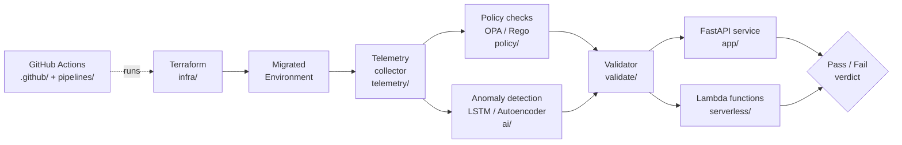

# Cloud Migration Assurance Framework

Migrating a workload to the cloud is the easy part. Knowing the migration actually worked, before your users find out it didn't, is the hard part.

This project is an MSc research framework that answers one question automatically: **is this migrated environment healthy and compliant, or not?** It checks the infrastructure against policy, watches the telemetry for anomalies, and gives a clear pass or fail instead of a gut feeling.

---

## The problem

Most teams validate a migration by hand. Someone clicks around, checks a few dashboards, runs a smoke test, and calls it done. That works until it doesn't. Config drift, a misapplied security rule, or a slow memory leak can all pass an eyeball check and then break in production a week later.

This framework replaces the eyeball check with something repeatable.

## What it does

1. **Provisions** the target environment with Terraform.
2. **Checks the configuration** against policy using OPA/Rego, so a non-compliant setup fails fast.
3. **Collects telemetry** from the running services.
4. **Runs anomaly detection** on that telemetry with an LSTM/Autoencoder model, catching the slow problems a threshold alert would miss.
5. **Reports a verdict** through a FastAPI service, and runs the whole thing on every change through GitHub Actions.

## Architecture



## How the repo is laid out

| Folder | What lives here |
| --- | --- |
| `infra/` | Terraform that provisions the environment |
| `serverless/` | AWS Lambda functions |
| `policy/` | OPA/Rego policies the config is checked against |
| `ai/` | Anomaly detection model and training code |
| `telemetry/` | Metrics collection |
| `validate/` | Orchestrates the checks and produces the verdict |
| `app/` | FastAPI service that exposes results |
| `pipelines/` + `.github/` | CI/CD automation |
| `deploy/` | Deployment scripts |
| `docs/` | Design notes and the full research report |

## Running it

```bash
pip install -r requirements.txt
./run_full_check.sh
```

The script runs the full pipeline end to end and prints the verdict.

## Results

I tested the framework by deliberately breaking things: planting bad config in the Terraform and injecting runtime anomalies, then checking whether the pipeline caught them.

**The policy layer caught everything it was meant to.** Insecure public subnets, over-permissive IAM roles, missing HTTPS enforcement, and wide-open security groups were planted in the Terraform templates. OPA flagged every one of them and failed the pipeline before anything deployed, across both test runs. Cheap, deterministic, and exactly the first line of defence you want.

**Anomaly detection got reliable once it had real data to learn from.** On a small telemetry sample the models worked but were jumpy. On the full dataset (over 900 metric points collected across several days) the autoencoder settled down: normal behaviour clustered tightly near zero, and the genuine problems (latency surges and database connection irregularities) showed up as clear spikes around 0.03 MSE, all of which got flagged. The LSTM forecaster tracked actual database read times closely once it had enough history to train on.

**The finding that matters:** static policy checks alone miss runtime problems, and runtime AI checks alone miss config problems. Running both as gates in the same pipeline caught issues that neither layer would catch on its own, and detection quality scaled directly with how much telemetry the models had seen.

## Scope and limits

Worth being straight about what this is and isn't. It runs on AWS only. The anomalies in testing were injected rather than naturally occurring, and the models were trained offline rather than retrained live. Those are the obvious next steps, not hidden flaws, and the design accounts for them.

## The full write-up

The complete research report is included in this repo as a PDF, with the methodology, evaluation, and findings in detail.

---

Built as part of an MSc in Cloud Computing. Stack: AWS Lambda, Terraform, OPA/Rego, FastAPI, GitHub Actions, and a Python anomaly detection model.
